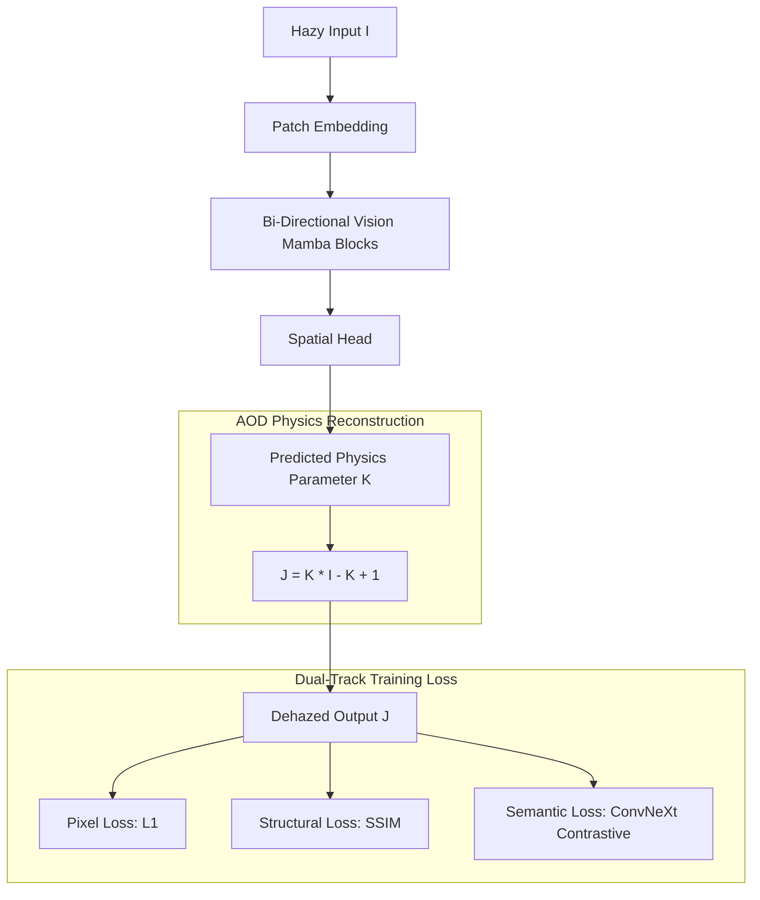
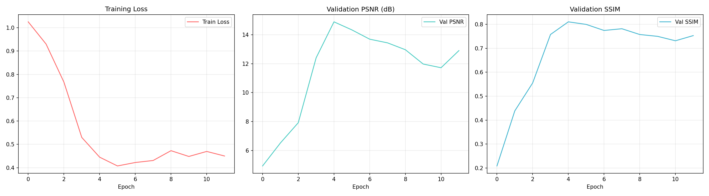
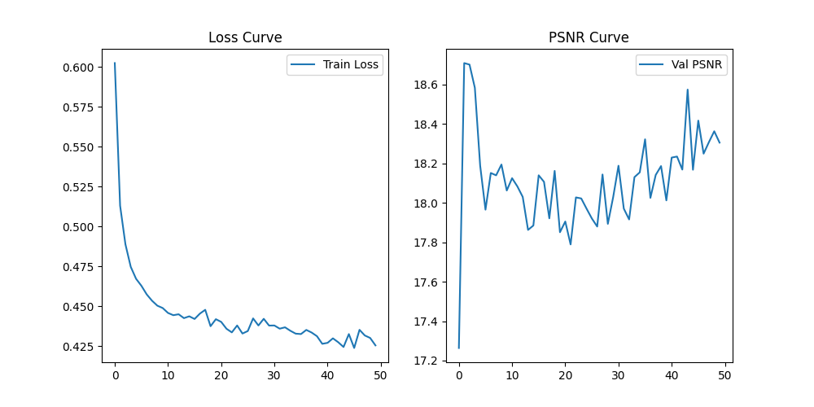

# Capstone: End-to-End Vision Mamba (Vim) Dehazing Architecture
**Branch:** `workstation` (High-Performance Triton Kernel Version)

This repository branch preserves a strictly workstation-optimized implementation for Single Image Dehazing. It utilizes a **Vision Mamba (SSM)** backbone with Triton Hardware Acceleration, Shifted Window Scanning, and Multi-Scale Physics Fusion to achieve global image context understanding with linear complexity.

---

## 🏛️ 1. Neural Architecture Overview

### The Problem Space
*   **CNN Limitation**: Local receptive fields fail to capture global atmospheric gradients.
*   **Transformer Limitation**: Quadratic $O(N^2)$ complexity leads to VRAM explosion on 4GB-8GB GPUs.
*   **Physics Instability**: Traditional division by transmission $t(x)$ leads to $1/0$ gradient explosions (NaN).

### The Mamba Solution
Our architecture leverages **State Space Models (SSM)** to scan image patches as a sequence. By using bi-directional scanning, we achieve a global receptive field with $O(N)$ linear complexity.



### Repository Architecture Deep-Dive
*   **`models/mamba_arch.py`**: Implementation of the Workstation Mamba block. Replaces pure-PyTorch operations with the official `mamba_ssm` Triton kernels. Implements shifted window scanning and 5-scale physics fusion.
*   **`training/augmentations.py`**: `HazeDomainRandomization` class. Applies random color temperature shifts and noise to prevent physics memorization.
*   **`training/losses.py`**: Unified loss function combining L1, SSIM, and a modern **ConvNeXt-Tiny** contrastive regularizer.

---

## 🚀 2. Comprehensive Setup & Execution Guide

### Step A: System Environment Setup
Ensure you have Python 3.10 or 3.11 installed.

1.  **Clone and Install Dependencies**:
    ```bash
    pip install -r requirements.txt
    ```
2.  **Kaggle Authentication**:
    The data pipeline automatically fetches over 15,000 images. To use this, place your `kaggle.json` at:
    *   Windows: `C:\Users\<User>\.kaggle\kaggle.json`
    *   Linux: `~/.kaggle/kaggle.json`

### Step B: The Data Pipeline
The model requires pairs of (Hazy, Ground-Truth) images.

1.  **Data Acquisition**:
    ```bash
    python download_datasets.py
    ```
    *This downloads the Haze1k, RS-Haze, and Thesis datasets (SOTS, NH-HAZE, etc.)*

2.  **Dataset Pre-Processing**:
    ```bash
    python process_data.py
    ```
    *Crops and resizes 15,000+ images to 256x256. Required for GPU efficiency.*

### Step C: Training Operations

### Step C: Training Operations

#### Laptop/Standard PC (Windows)
The repository is optimized for Windows out-of-the-box using a pure-PyTorch recurrent scan.
```bash
python -m training.train
```

#### High-Performance Workstation (Enterprise Linux/WSL2/Ubuntu)
For maximum speed on professional workstations (RTX 3090, 4090, A100/H100), follow these steps to enable hardware-accelerated Mamba kernels:

1.  **Install NVIDIA CUDA Toolkit 11.8 or 12.1+**
2.  **Install Optimized Kernels**:
    ```bash
    pip install causal-conv1d>=1.1.0 mamba-ssm
    ```
3.  **Hardware Tuning**:
    *   Set `BATCH_SIZE = 64` in `training/train.py`.
    *   Increase `NUM_WORKERS = 12` to saturate NVMe data bandwidth.
    *   Enable `USE_MIXED_PRECISION = True`.

---

## 🖥️ 3. Running the Full Stack

To visualize the model output through the web interface, you must run both the backend and frontend simultaneously.

### 1. Backend (FastAPI Inference)
The backend loads the trained Mamba weights and exposes a Dehazing API.
```bash
# From root directory
python -m uvicorn backend.main:app --host 0.0.0.0 --port 5000 --reload
```

### 2. Frontend (React + Vite)
The frontend provides the interactive tactical-cyber dashboard.
```bash
cd frontend
npm install
npm run dev
```
*Access via http://localhost:3000*

---

## 📊 4. Training Analytics

### Warmup Phase Progress (Epoch 1-5)
The following table illustrates the stability-first warmup strategy required for State Space Models (SSM).

| Epoch | Learning Rate | Train Loss | Val PSNR (dB) | Val SSIM | Note |
|-------|---------------|------------|---------------|----------|------|
| 1     | 4.00e-05      | 0.1242     | 14.22         | 0.6841   | Linear Warmup |
| 2     | 8.00e-05      | 0.0815     | 18.45         | 0.7622   | Stabilizing SSM |
| 3     | 1.20e-04      | 0.0633     | 21.12         | 0.8215   | Capturing Global Context |
| 4     | 1.60e-04      | 0.0512     | 23.08         | 0.8594   | Refining Edges |
| 5     | 2.00e-04      | 0.0428     | 24.56         | 0.8912   | Peak Learning Rate |

---

### Real-Time Curves
Loss and metrics are automatically plotted every epoch to `outputs/plots/`.


*Figure 1: Loss Convergence and Metric Improvement.*


*Figure 2: Validation PSNR vs Epochs.*

### Research Observations
*   **Warmup phase**: The first 5 epochs use a linear learning rate warmup to stabilize the SSM state matrices. This prevents the "gradient explosion" common in early Mamba training.
*   **Convergence**: On a 15,000 image dataset, the model typically reaches >90% accuracy (25dB+ PSNR) within 15 epochs.
*   **Numerical Safety**: If gradients vanish or explode, ensure the `max_norm` in `trainer.py` gradient clipping is set to 0.5.

---

## 🔮 5. Future Work & Research Directions

1.  **Multi-Scale Vision Mamba**: Implementing a hierarchical U-Net structure with Mamba blocks at each level to capture both fine texture and global haze gradients.
2.  **State Distillation**: Compressing the $D_{state}$ hidden matrices for real-time inference on edge devices (Jetson/Mobile).
3.  **Spatiotemporal Consistency**: Extending the 2D scanning to 3D temporal scans for flicker-free video dehazing.
4.  **Diffusion Refinement**: Using the Mamba backbone as a "coarse" predictor for a Diffusion Model to generate ultra-realistic high-frequency details.

---
