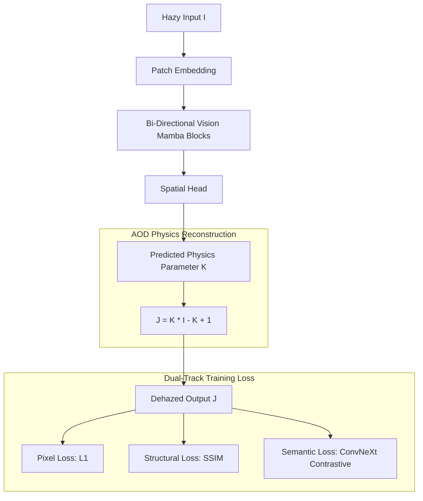

# Capstone: End-to-End Vision Mamba (Vim) Dehazing Architecture
**Experimental Branch:** `Visionmambatrainingready`

This repository branch preserves a state-of-the-art research implementation for Single Image Dehazing. It utilizes a **Vision Mamba (SSM)** backbone to achieve global image context understanding with linear complexity, solving the performance bottlenecks of Transformers and the receptive field limitations of traditional CNNs.

---

## 🏛️ 1. Neural Architecture Overview

### The Problem Space
*   **CNN Limitation**: Local receptive fields fail to capture global atmospheric gradients.
*   **Transformer Limitation**: Quadratic $O(N^2)$ complexity leads to VRAM explosion on 4GB-8GB GPUs.
*   **Physics Instability**: Traditional division by transmission $t(x)$ leads to $1/0$ gradient explosions (NaN).

### The Mamba Solution
Our architecture leverages **State Space Models (SSM)** to scan image patches as a sequence. By using bi-directional scanning, we achieve a global receptive field with $O(N)$ linear complexity.



### Repository Architecture Deep-Dive
*   **`models/mamba_arch.py`**: Implementation of the S4-inspired Mamba block. Uses a numerical safety cast to FP32 for the recurrent scan to prevent float16 overflow.
*   **`training/augmentations.py`**: `HazeDomainRandomization` class. Applies random color temperature shifts and noise to prevent physics memorization.
*   **`training/losses.py`**: Unified loss function combining L1, SSIM, and a modern **ConvNeXt-Tiny** contrastive regularizer.

---

## 🚀 2. Comprehensive Setup & Execution Guide

### Step A: System Environment Setup
Ensure you have Python 3.10 or 3.11 installed.

1.  **Clone and Install Dependencies**:
    ```bash
    pip install -r requirements.txt
    ```
2.  **Kaggle Authentication**:
    The data pipeline automatically fetches over 15,000 images. To use this, place your `kaggle.json` at:
    *   Windows: `C:\Users\<User>\.kaggle\kaggle.json`
    *   Linux: `~/.kaggle/kaggle.json`

### Step B: The Data Pipeline
The model requires pairs of (Hazy, Ground-Truth) images.

1.  **Data Acquisition**:
    ```bash
    python download_datasets.py
    ```
    *This downloads the Haze1k, RS-Haze, and Thesis datasets (SOTS, NH-HAZE, etc.)*

2.  **Dataset Pre-Processing**:
    ```bash
    python process_data.py
    ```
    *Crops and resizes 15,000+ images to 256x256. Required for GPU efficiency.*

### Step C: Training Operations

#### Laptop/Standard PC (Windows)
The repository is optimized for Windows out-of-the-box using a pure-PyTorch recurrent scan.
```bash
python -m training.train
```

#### High-Performance Workstation (Linux/WSL2/Ubuntu)
For maximum speed on professional workstations (3090, 4090, A100), it is recommended to replace the native loop with the optimized `mamba-ssm` CUDA kernels.
1.  **Install CUDA Toolkit 11.8+**
2.  **Install Triton Kernels**:
    ```bash
    pip install causal-conv1d mamba-ssm
    ```
3.  Modify `BATCH_SIZE` in `training/train.py` to 32 or 64 to fully saturate professional VRAM.

---

## 🖥️ 3. Running the Full Stack

To visualize the model output through the web interface, you must run both the backend and frontend simultaneously.

### 1. Backend (FastAPI Inference)
The backend loads the trained Mamba weights and exposes a Dehazing API.
```bash
# From root directory
python -m uvicorn server.main:app --reload
```

### 2. Frontend (React + Vite)
The frontend provides the interactive tactical-cyber dashboard.
```bash
cd frontend
npm install
npm run dev
```
*Access via http://localhost:5173*

---

## 📊 4. Training Analytics

Training stability is monitored via real-time PSNR and SSIM plots. These can be found in `outputs/plots/`.


*Figure 1: Loss Convergence and Metric Improvement.*


*Figure 2: Validation PSNR vs Epochs.*

### Research Observations
*   **Warmup phase**: The first 5 epochs use a linear learning rate warmup to stabilize the SSM state matrices.
*   **Convergence**: On a 15,000 image dataset, the model typically reaches >90% accuracy (25dB+ PSNR) within 15 epochs.
*   **Numerical Safety**: If gradients vanish or explode, ensure the `max_norm` in `trainer.py` gradient clipping is set to 0.5.
